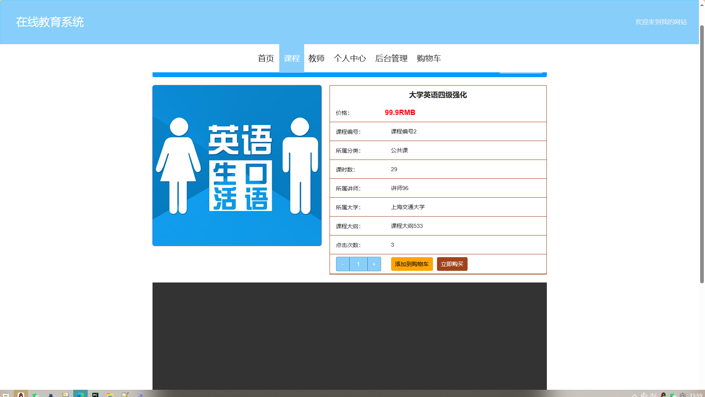
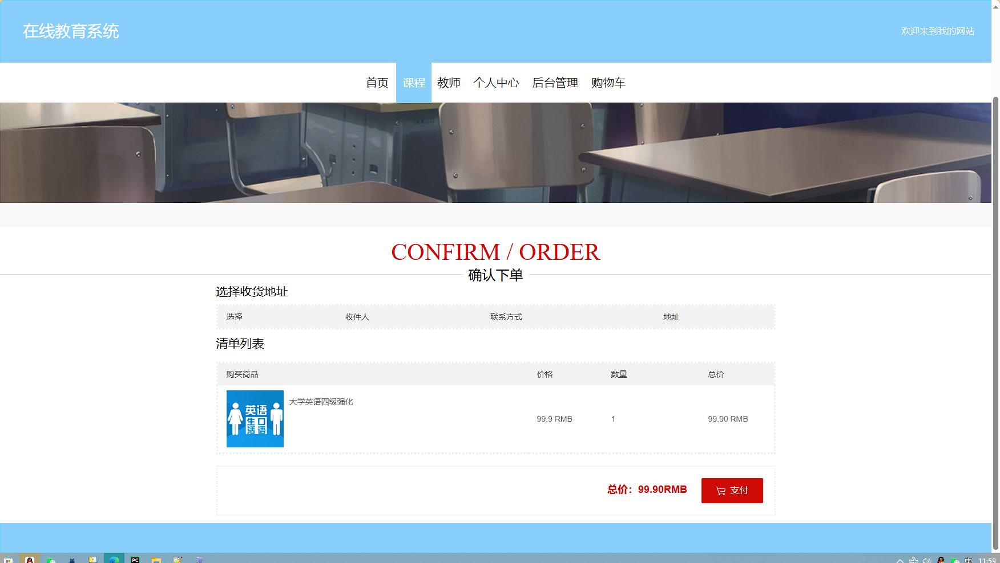
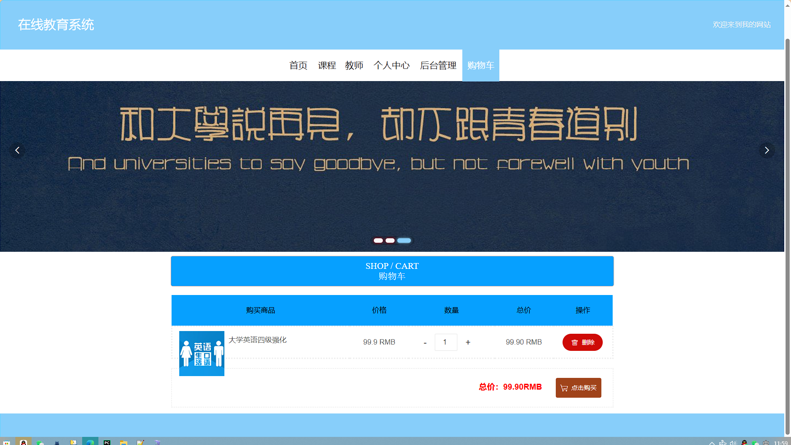
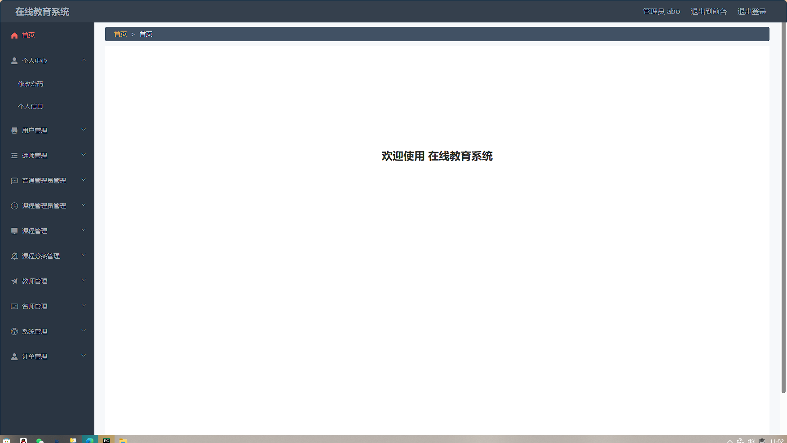
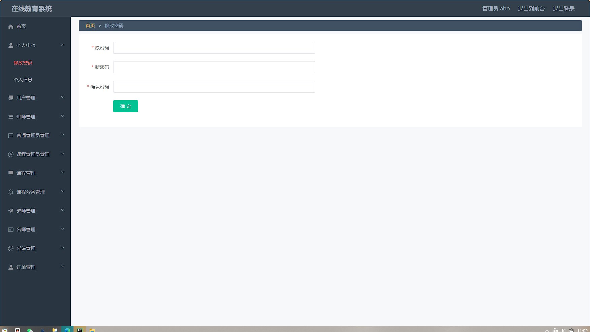
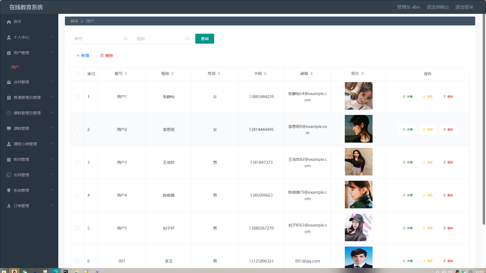
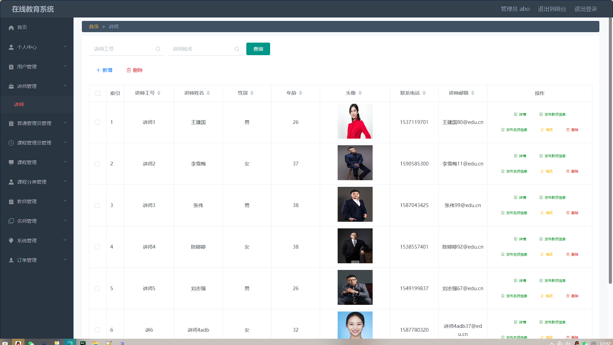
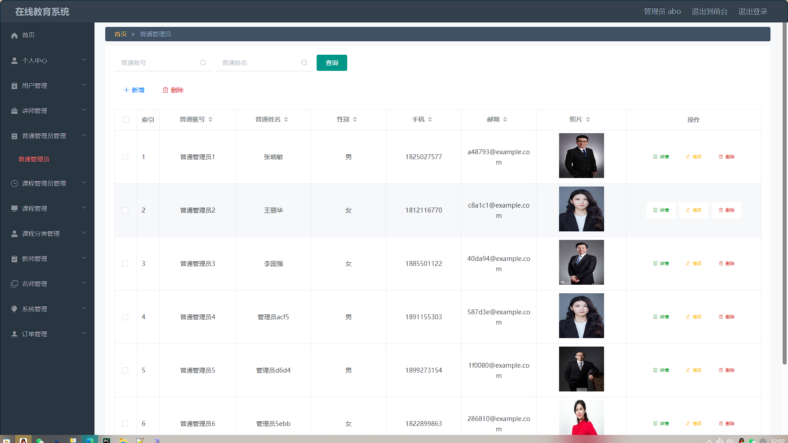
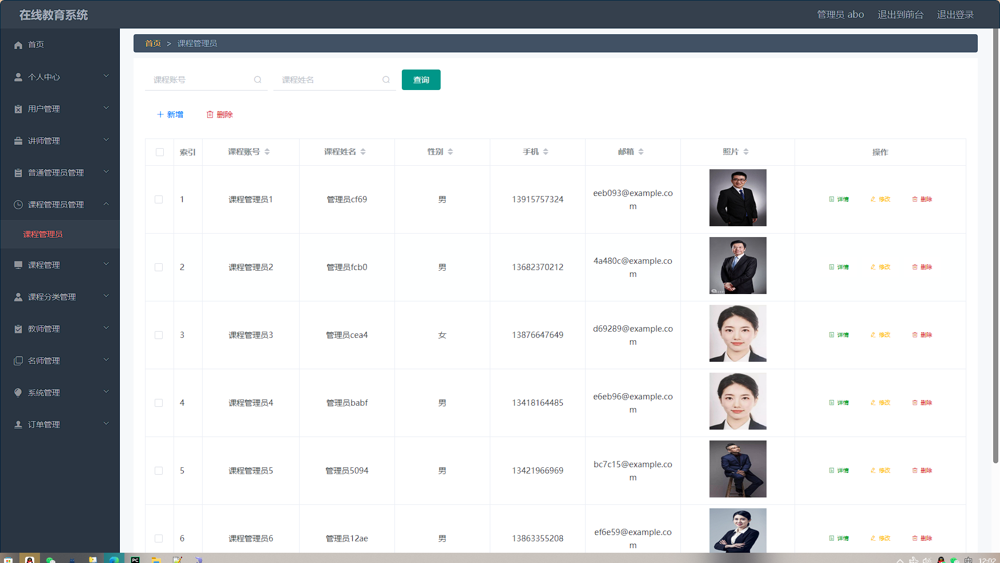
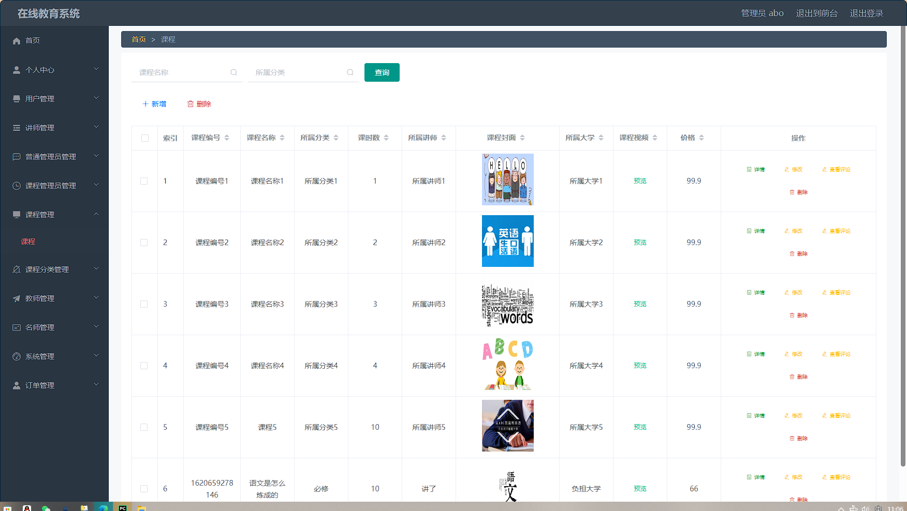

# springboot111在线教育系统 / springboot-Online_Education_System


> 更多毕设项目可跳转至项目导航栏检索：[毕设项目](http://sysadmin.3vfree.vip)，需要联系博主v：xq-lucky311，q：1047944234. 备注：项目咨询注：由于前端项目太大，仅上传了后端代码，未包含前端代码...

## 项目简介  
基于 SpringBoot + MyBatis-Plus + Shiro 的 B/S 架构在线教育平台，集成课程管理、用户权限体系、支付订单和教学资源管理功能。采用 MySQL 实现数据存储，支持多角色管理（管理员/课程管理员/普通用户）和课程收藏购买等核心业务场景。

## 特征介绍  
- **分层架构**：标准 MVC 模式分层，包含 Controller/Service/DAO/Entity 四层架构  
- **权限管理**：集成 Shiro 实现动态权限控制，支持管理员/课程管理员多级权限体系  
- **数据持久化**：MyBatis-Plus 增强 ORM 操作，XML 映射文件与注解双模式开发  
- **工具集成**：封装文件上传、MD5 加密、百度 AI 接口调用等公共工具类  
- **多数据模型**：包含 VO/View/Model 多维度数据对象，支持复杂业务场景扩展  
- **接口安全**：通过 AuthorizationInterceptor 实现全局请求鉴权拦截  

## 代码结构 
```
src/
├── main/
│   ├── java/
│   │   ├── com/
│   │   │   ├── annotation/          # 权限注解
│   │   │   │   ├── IgnoreAuth.java
│   │   │   ├── config/              # 全局配置
│   │   │   │   ├── MybatisPlusConfig.java
│   │   │   ├── controller/          # 接口层
│   │   │   │   ├── AddressController.java
│   │   │   │   ├── CartController.java
│   │   │   ├── entity/              # 数据实体
│   │   │   │   ├── AddressEntity.java
│   │   │   │   ├── model/           # 业务模型
│   │   │   │   ├── view/            # 视图对象  
│   │   │   ├── interceptor/         # 请求拦截
│   │   │   │   ├── AuthorizationInterceptor.java
│   │   │   ├── service/             # 服务层
│   │   │   │   ├── impl/            # 服务实现
│   │   │   ├── utils/               # 工具包
│   │   │   │   ├── MD5Util.java
│   │   │   │   ├── BaiduUtil.java
│   ├── resources/
│   │   ├── mapper/                  # MyBatis映射
│   │   │   ├── AddressDao.xml
│   │   ├── application.yml          # 主配置
│   │   ├── static/                  # 静态资源
│   │   │   ├── upload/              # 文件存储
```
## 使用说明
**推荐环境**：Chrome 浏览器 + JDK8 + MySQL5.7+

**启动配置**：
1. 创建 MySQL 数据库：springboot8525u
2. 修改 application.yml 数据库连接配置：
```yaml
url: jdbc:mysql://127.0.0.1:3306/springboot8525u?useUnicode=true
username: root
password: root


# 项目实际截图：

## 前台：






## 后台：









> 等等...

# 精选项目导航 & 快速部署工具
## 项目资源一站直达
- ​**访问项目导航站**：[点击进入](http://sysadmin.3vfree.vip)**快速检索所需项目名称**
- ​**技术栈全覆盖**：Java/SSm/Spring Boot/小程序等主流技术方案
- ​**配套资源**：每个项目均提供部署文档 + 演示视频（附效果截图）

### ▌导航站预览


### ▌工具界面预览


## 捐赠
> 博主将持续更新Java全栈开发项目，包含ssm，springboot，前后端分离系统等项目。
> 此外如果您够宽裕，请博主喝杯咖啡吧！捐赠将用于服务器维护与开源社区建设，感谢您的认可！
> 如需更多Java相关项目毕设3000+，有其他项目需求，sql文件等可联系博主v:xq-lucky311

---